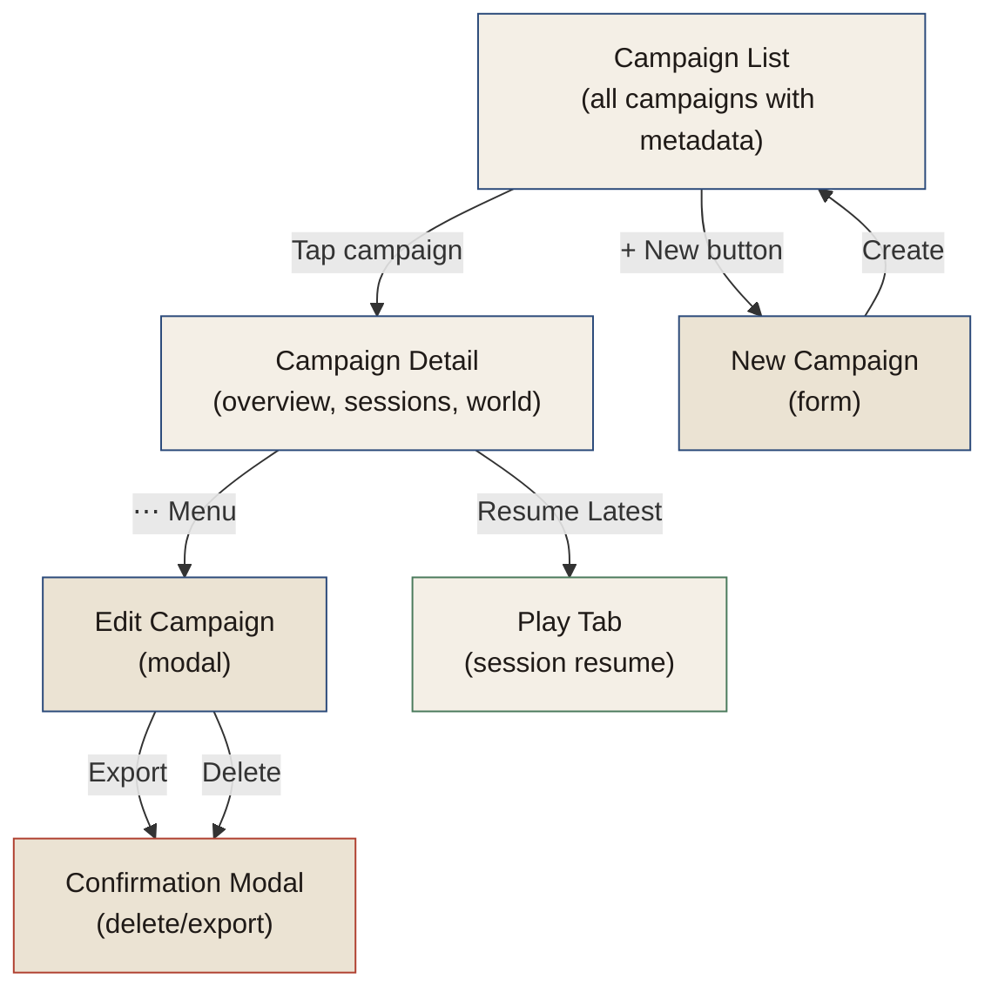
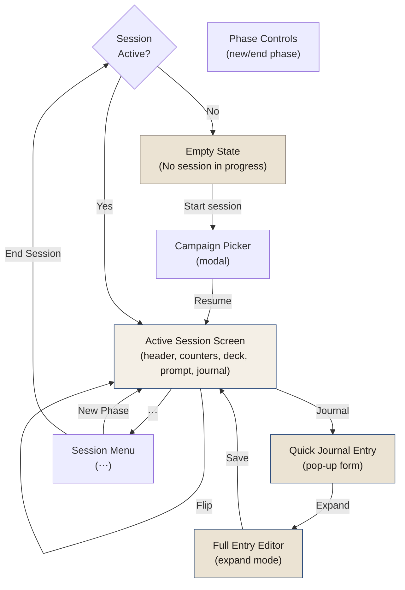
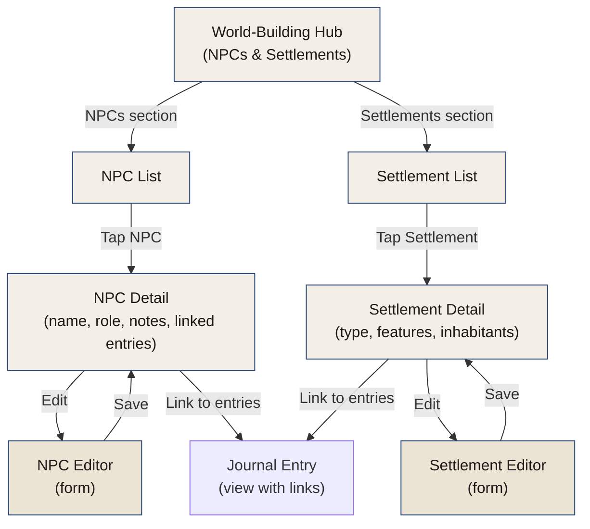
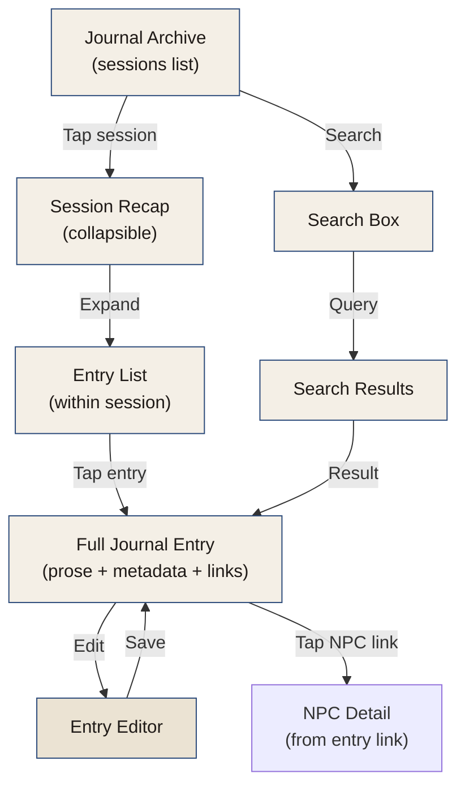
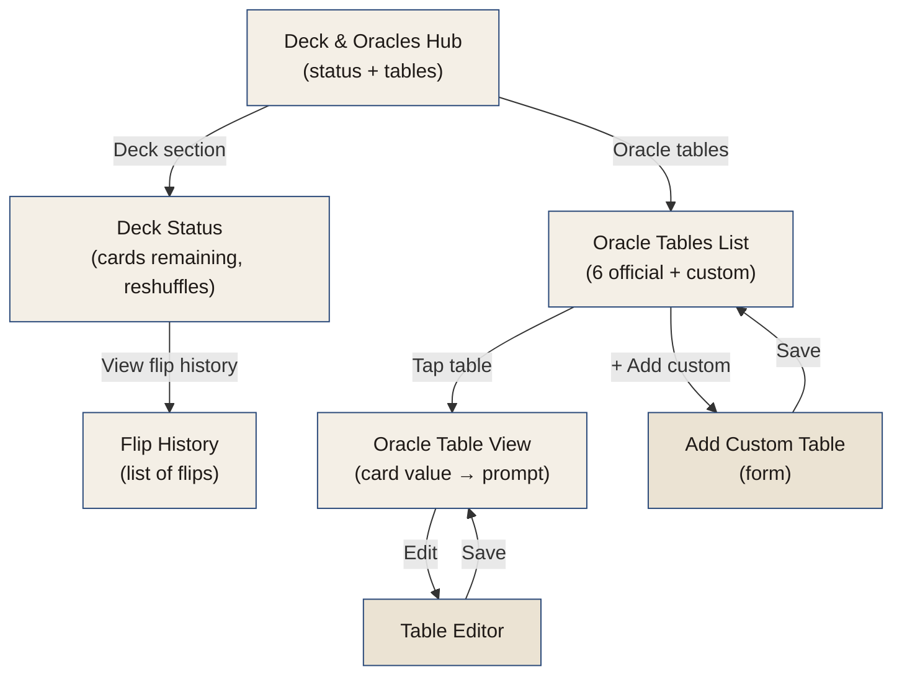
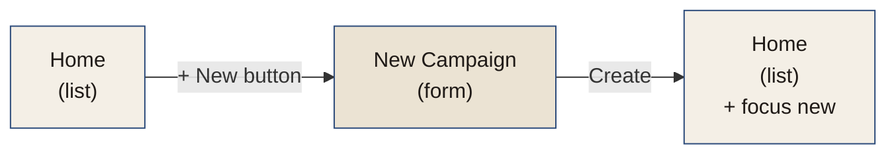
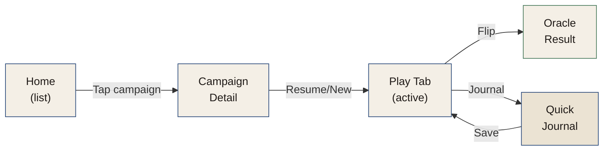
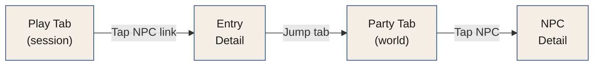
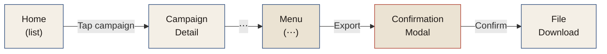

# Information Architecture

How screens relate and how users navigate through the app.

## Core Navigation Model

The app uses **bottom tab navigation** (5 main tabs) as the primary navigation method. Each tab represents a distinct activity or view mode. Within each tab, there may be sub-screens accessed via push navigation (backward arrow) or modal overlays.

### Tab Structure

```mermaid
graph LR
    HOME["HOME<br/>Campaign list"]
    PLAY["PLAY<br/>Active session"]
    PARTY["PARTY<br/>World-building"]
    STORY["STORY<br/>Journal archive"]
    CARDS["CARDS<br/>Deck & oracles"]
    
    HOME ↔ PLAY ↔ PARTY ↔ STORY ↔ CARDS
    
    style HOME fill:#f4efe6,stroke:#2b4a7a,color:#1f1a17
    style PLAY fill:#f4efe6,stroke:#2b4a7a,color:#1f1a17
    style PARTY fill:#f4efe6,stroke:#2b4a7a,color:#1f1a17
    style STORY fill:#f4efe6,stroke:#2b4a7a,color:#1f1a17
    style CARDS fill:#f4efe6,stroke:#2b4a7a,color:#1f1a17
```

**Home** — Campaign list and lifecycle management  
**Play** — Active session, flip mechanic, prompt display  
**Party** — Character / world-building details (NPCs, settlements)  
**Story** — Journal archive, session recaps  
**Cards** — Deck management, oracle tables, custom tables (later)

---

## Screen Map

### HOME Tab: Campaign Management



### PLAY Tab: Active Session & Flip Mechanic



**Oracle Prompt Display**
```
┌─────────────────────────┐
│ ♣ COMBAT                │
│ 9 of clubs              │
├─────────────────────────┤
│ A wandering Rook,       │
│ scarred but proud       │
│                         │
│ It blocks the path.     │
│ Will you fight, parley, │
│ or flee?                │
└─────────────────────────┘
```

**Quick Journal Entry**
```
Pop-up or inline form:
├─ Text area (prose entry)
├─ [Voice] button (optional voice memo)
├─ [Save] button
└─ [Expand] → full journal editor
```

**Phase Menu** (⋯)
```
├─ [New Phase]
├─ [End Session]
├─ [View Session Recap]
└─ [Cancel]
```

**Campaign Picker** (start session modal)
```
Recent Campaigns
├─ [The Iron Vale] — last played 2 days ago
├─ [Salt & Stone] — last played 1 week ago
└─ [Glasswood] — last played 30 days ago
```

### PARTY Tab: World-Building



### STORY Tab: Journal Archive



### CARDS Tab: Deck & Oracles



---

## Navigation Flows

### "Start New Campaign" Flow



### "Play Campaign" Flow



### "Review World" Flow



### "Export Campaign" Flow



---

## Key Design Decisions

### Tab Navigation

- **Why tabs?** Clear mental model. Each tab = one mode (list, play, world, story, cards).
- **Why 5?** Covers core workflows: campaign list (home), gameplay (play), world-building (party), journal (story), oracle reference (cards).
- **Tab persistence:** When you switch tabs and come back, you're back where you left off (scroll position, open entry, etc.).

### No Deep Nesting

- Maximum one level of push navigation (detail screen from list).
- Modals used sparingly (confirmation, pickers, forms).
- Goal: users always know where they are and how to get back (back button or tab switch).

### Quick Entry Pop-up

- Journal entry form appears inline during play, not a separate screen.
- Users can "expand" to full editor if needed.
- Keeps flow fast and uninterrupted.

### World-Building Integrated

- Party tab shows all world details (NPCs, settlements) in one place.
- Linked to journal entries (so you see where they were discovered).
- Not a separate wiki or complex graph—just a searchable reference.

---

## Screen Priority (MVP)

**Must have for v0.1.0:**
1. Home → Campaign list + detail
2. Play → Flip mechanic + oracle prompt
3. Play → Quick journal entry
4. Story → Journal archive (flat list)
5. Cards → Deck status + oracle table view

**Nice to have (v0.2.0+):**
- Party → Full NPC/settlement management
- Story → Advanced search, timeline view
- Cards → Custom oracle builder
- Full entry editor (expand mode)
- Session recap view

---

## Accessibility Notes

- **Tab order:** Natural reading order (top to bottom, left to right)
- **Focus management:** Clear focus indicators on interactive elements
- **Modal trapping:** Focus trapped in modals (OK/Cancel)
- **Gestures:** All interactions available via touch + tap (no long-press-only actions)
- **Mobile:** all touch targets min 44×44px
