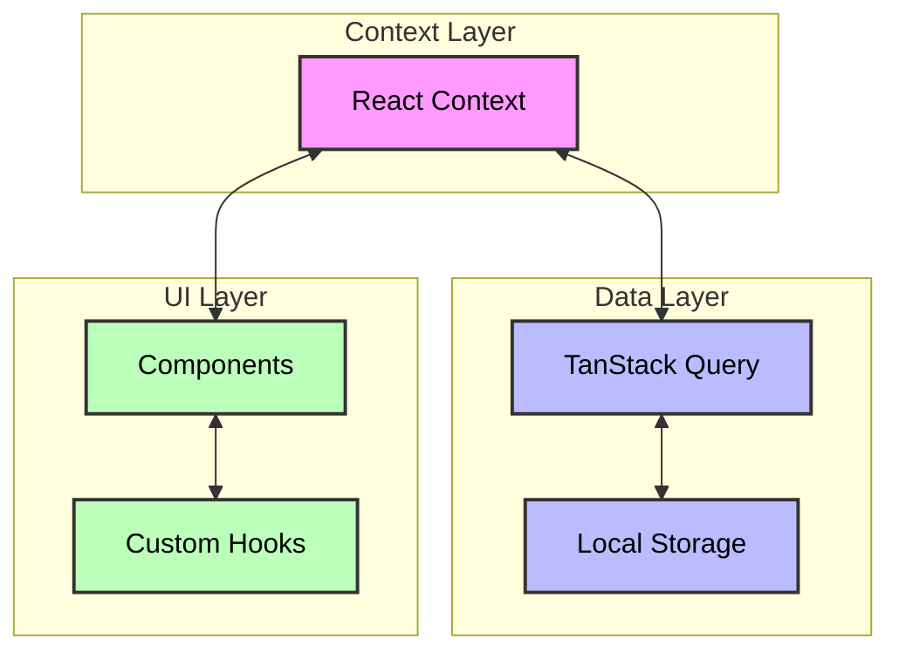

# Colostle Companion Refactoring Plan

## Overview

This document outlines the plan to refactor the Colostle Companion application to improve maintainability, reduce prop drilling, and implement proper routing and state management.

## Current Issues

1. Deep prop drilling through components
2. No centralized state management
3. Limited routing structure
4. No persistent local storage implementation

## Phase 1: State Management Setup

### 1.1 Global State Implementation

- Create a new `src/lib/store` directory with the following structure:

  ```
  store/
  ├── CharacterContext.tsx # Character state and business logic
  ├── CampaignContext.tsx  # Campaign state and business logic
  ├── SessionContext.tsx   # Session state and business logic
  └── GlobalContext.tsx    # Global state (loading, errors, etc.)
  ```

- Implement global state using React Context for business logic:

  - Character state (selection, validation, business rules)
  - Campaign state (active campaign, campaign rules)
  - Session state (active session, session flow)
  - UI state (loading, errors, modals, etc.)

- Implement TanStack Query for data operations:
  - Character data fetching and caching
  - Campaign data fetching and caching
  - Session data fetching and caching
  - Optimistic updates for mutations
  - Automatic background refetching
  - Error handling and retry logic

### 1.2 Local Storage Integration

- Create a new `src/lib/storage` directory
- Implement storage adapters for TanStack Query:
  - IndexedDB adapter for larger datasets
  - localStorage adapter for user preferences
- Implement proper data versioning and migration strategies

## Phase 2: Routing Structure

### 2.1 Route Implementation

Create the following routes:

- `/` - Character selection/management (landing page)
- `/:characterId` - Character details
- `/:characterId/campaigns` - Campaign selection/management
- `/:characterId/campaigns/:campaignId` - Campaign details
- `/:characterId/campaigns/:campaignId/sessions` - Session list
- `/:characterId/campaigns/:campaignId/sessions/:sessionId` - Session view

### 2.2 Route Components

Create corresponding components:

- `CharacterSelection` - Main landing page with character management
- `CharacterDetails` - Character profile and stats
- `CampaignSelection` - List of campaigns for selected character
- `CampaignDetails` - Campaign information and management
- `SessionList` - List of sessions for selected campaign
- `SessionView` - Individual session view

### 2.3 Direct Navigation Requirements

- Support direct navigation to any route
- Pre-fetch required data before rendering
- Maintain character context when navigating directly to campaigns/sessions
- Handle missing data gracefully with appropriate redirects
- Ensure URL structure reflects current application state

## Phase 3: Component Refactoring

### 3.1 Character Context Requirements

- Manage character selection state
- Sync character selection with URL parameters
- Provide character-related business logic
- Handle character data fetching and caching
- Support character creation, updates, and deletion
- Maintain character state across route changes

### 3.2 Route Protection Requirements

- Ensure required data is available before rendering
- Handle redirects when required data is missing
- Maintain proper navigation hierarchy
- Support bookmarking and sharing of direct links
- Handle edge cases (invalid IDs, missing data)

### 3.3 State Management Requirements

- Character selection must be synced with URL
- TanStack Query must handle data fetching and caching
- Context must provide business logic and state access
- State updates must trigger appropriate UI updates
- Error states must be properly handled and displayed

### 3.4 User Experience Requirements

- Smooth navigation between routes
- Proper loading states during data fetching
- Clear error messages when things go wrong
- URL must reflect current application state
- Support for browser back/forward navigation
- Maintain state during page refreshes

## Phase 4: Testing and Documentation

### 4.1 Testing

- Add unit tests for new components
- Add integration tests for routes
- Add tests for state management
- Add tests for local storage utilities

### 4.2 Documentation

- Update README with new architecture
- Add component documentation
- Add state management documentation
- Add routing documentation

## Implementation Order

1. **State Management Setup**

   - Set up TanStack Query provider
   - Create storage adapters
   - Implement basic queries and mutations
   - Create context providers
   - Implement custom hooks

2. **Routing Implementation**

   - Set up route structure
   - Create basic route components
   - Implement navigation

3. **Component Refactoring**

   - Break down existing components
   - Implement new components
   - Connect to global state

4. **Testing and Documentation**
   - Add tests
   - Update documentation
   - Perform final review

## Technical Decisions

### State Management

- Use React Context for business logic and UI state
- Use TanStack Query for:
  - Data fetching and caching
  - Server state synchronization
  - Optimistic updates
  - Background refetching
  - Error handling
- Implement custom hooks for:
  - Context access
  - Query access
  - Combined state operations
- Use TypeScript for type safety

### Routing

- Use TanStack Router for type-safe routing
- Implement proper route guards
- Add loading states for route transitions

### Local Storage

- Use IndexedDB for larger data sets
- Use localStorage for user preferences
- Implement proper data versioning

### Component Architecture

- Follow atomic design principles
- Implement proper component composition
- Use proper TypeScript interfaces

### Data Flow Architecture



### State Management Rules

1. **Context Usage**

   - Business logic and rules
   - UI state management
   - Cross-component communication
   - Feature flags and settings
   - **Sole interface for components to access data**
   - **All data operations must be initiated through Context**

2. **TanStack Query Usage**

   - Data fetching and caching
   - Server state management
   - Optimistic updates
   - Background synchronization
   - Error handling and retries
   - **Only accessible through Context**
   - **Directly manages Local Storage**

3. **Local Storage Usage**

   - Persistent data storage
   - Offline support
   - User preferences
   - Data versioning
   - **Only accessible through Context and TanStack Query**

4. **Component Rules**
   - Components must never directly access TanStack Query
   - Components must never directly access Local Storage
   - All data operations must be initiated through Context
   - Components should use custom hooks provided by Context

## Migration Strategy

1. **Incremental Changes**

   - Implement changes one feature at a time
   - Maintain backward compatibility
   - Test thoroughly before moving to next phase

2. **State Migration**

   - Gradually move state to global context
   - Update components to use new state management
   - Remove prop drilling as we go

3. **Route Migration**
   - Implement new routes alongside existing ones
   - Gradually move functionality to new routes
   - Remove old routing when complete

## Success Criteria

1. **Code Quality**

   - Reduced prop drilling
   - Improved type safety
   - Better component isolation
   - Proper error handling

2. **Performance**

   - Improved load times
   - Better state management
   - Optimized data fetching

3. **User Experience**
   - Smoother navigation
   - Better error feedback
   - Improved loading states

## Next Steps

1. Review and approve this plan
2. Set up state management structure
3. Begin implementing routes
4. Start component refactoring
5. Add tests and documentation

## Timeline Estimate

- Phase 1: 2-3 days
- Phase 2: 2-3 days
- Phase 3: 3-4 days
- Phase 4: 2-3 days

Total estimated time: 9-13 days
