# Colostle Companion User Flows

This document outlines the key user flows for the Colostle Companion app MVP, using Mermaid.js diagrams to visualize the essential paths users will take.

## Flow 1: Character Selection and Session Management

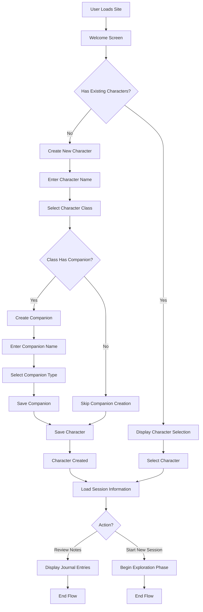

## Flow 2: Exploration Phase and Card Drawing

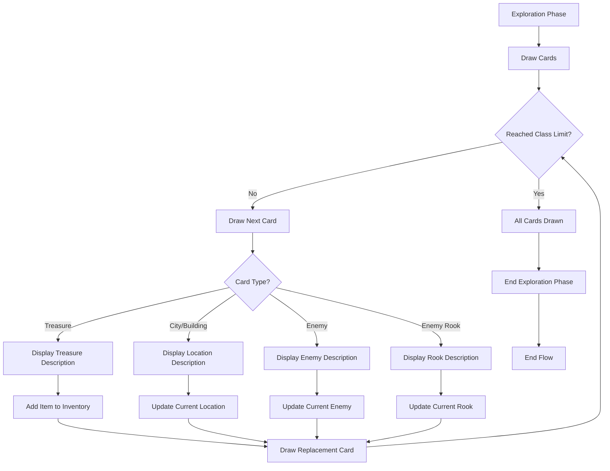

## Flow 3: Progress Saving

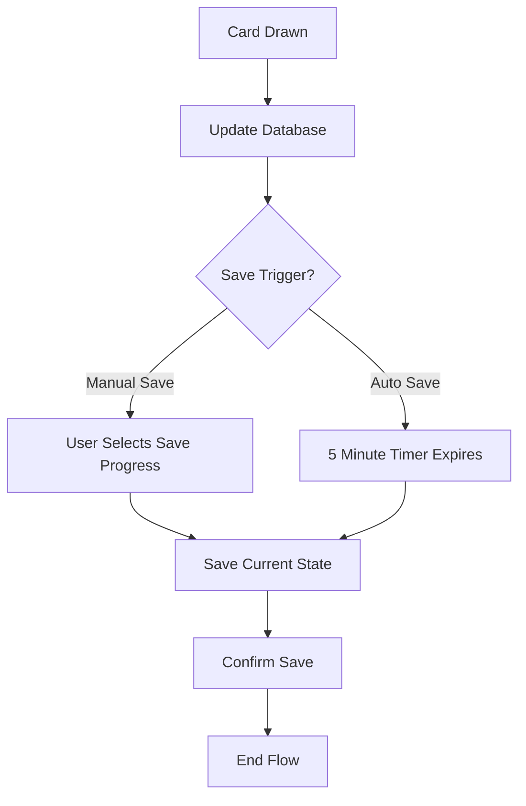

## Flow 4: Session Completion

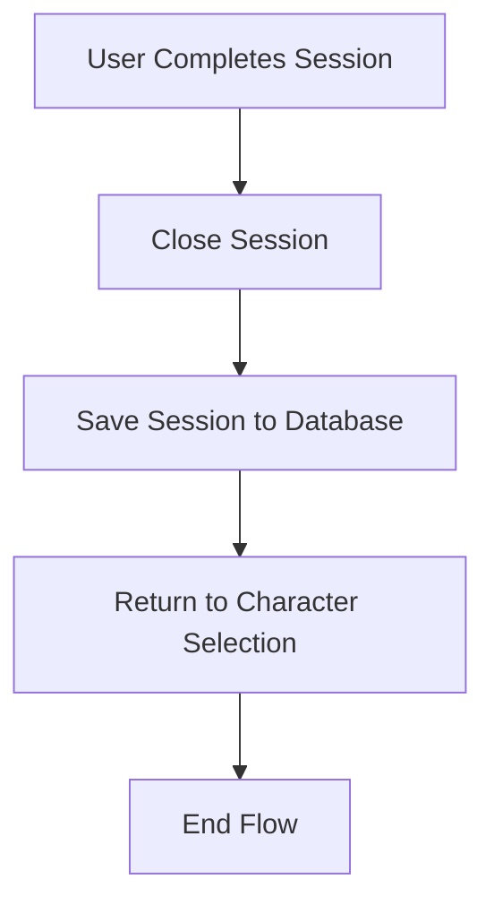

## Onboarding Flow

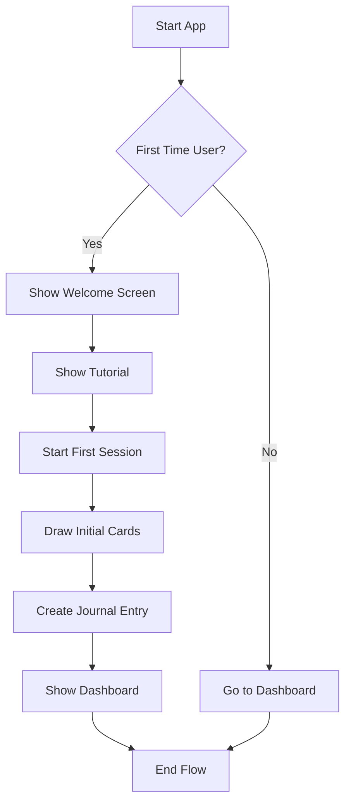

## Session Management Flow

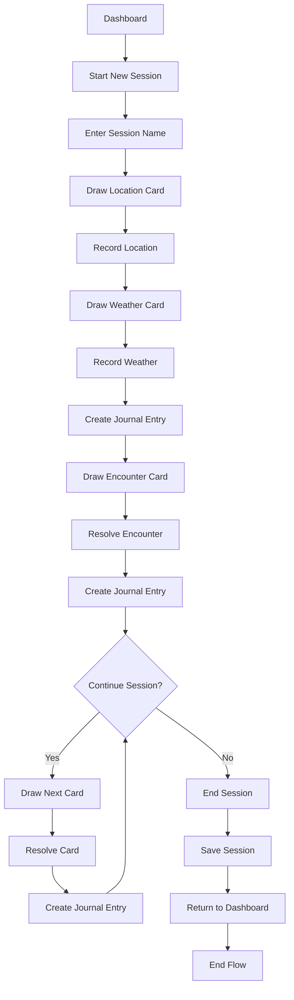

## Card Drawing and Resolution Flow

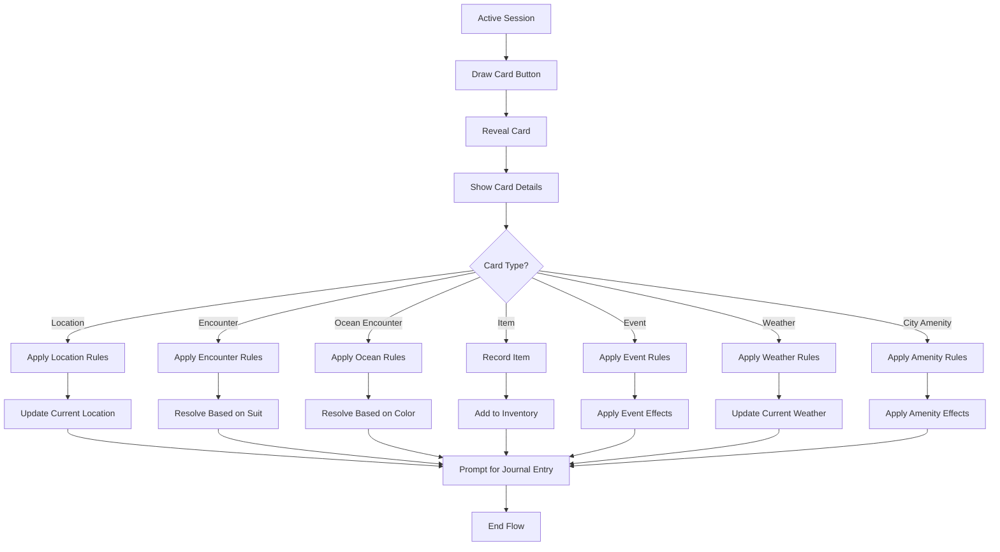

## Journal Entry Creation Flow

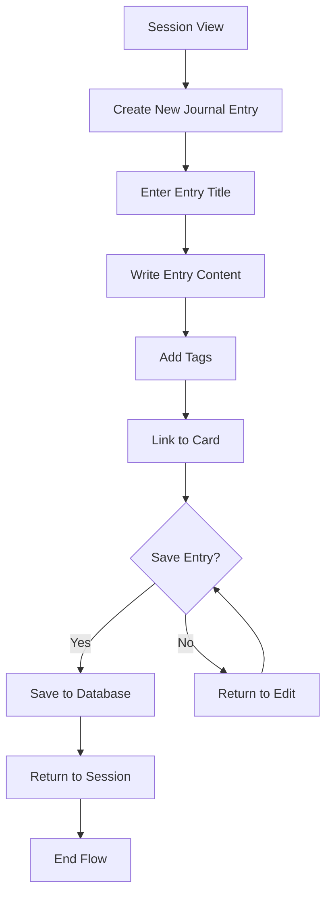

## Journal Browsing Flow

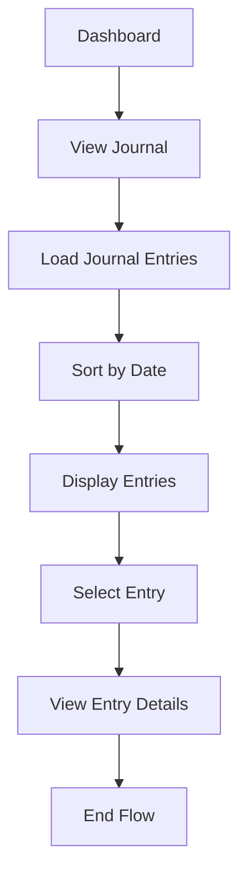

## Session History Flow

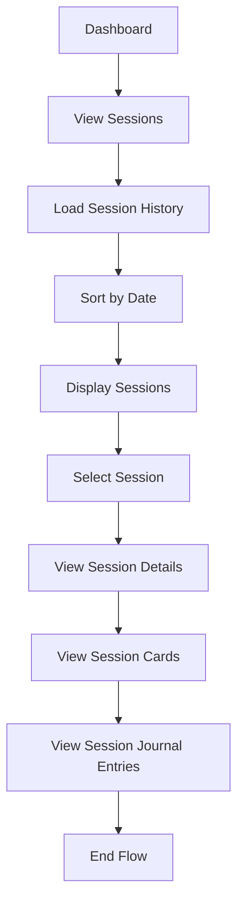

## Data Export/Import Flow

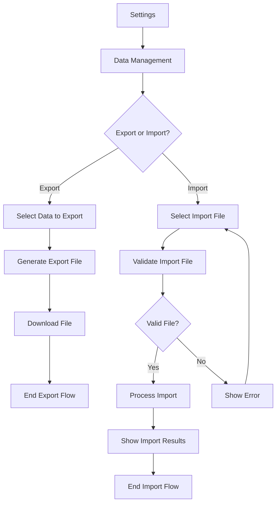

## Settings Flow

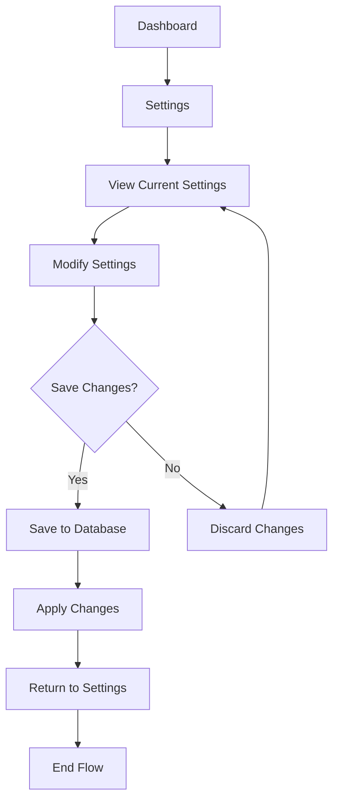
