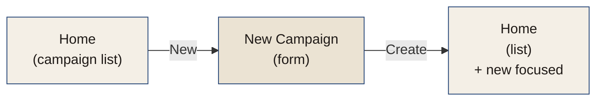
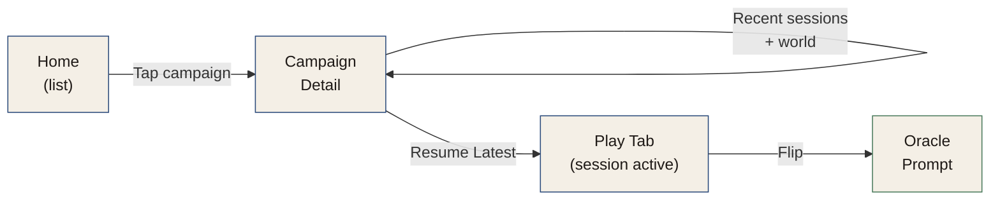
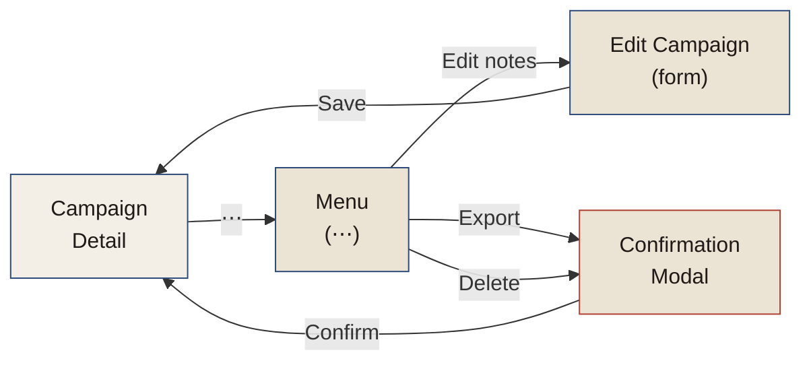

# F-001: Campaign Management

Create, list, resume, pause, and delete **campaigns**. Each campaign is a self-contained story with its own deck, journal, and world-building notes.

## What it does

- **Create campaign** — new story, named by player, initialized with empty deck and journal
- **List campaigns** — show all campaigns with last-accessed date, session count, current phase
- **Resume campaign** — open an existing campaign and continue where you left off
- **Pause session** — save mid-session without closing the campaign
- **View campaign details** — summary of deck state (cards remaining, reshuffles), total sessions, key NPCs/settlements discovered
- **Delete campaign** — remove a campaign entirely (with confirmation)

## Contracts

**Create Campaign:**
- Input: campaign name, optional theme/genre notes
- Output: new campaign with empty deck (52 cards, shuffled), empty journal, empty world-building section
- Side effect: campaign added to list with timestamp

**Resume Campaign:**
- Input: campaign ID
- Output: previous session restored (current phase, flip history, journal state, counters)
- Note: if no session in progress, show phase selection or last session recap

**List Campaigns:**
- Output: all campaigns sorted by last-accessed (most recent first)
- Each entry shows: name, story hook (if set), sessions played, current status (active/paused)

## UX Flows

### Flow 1: "Create a New Campaign"

**User goal:** I want to start a new story.

**User actions:**
1. Tap [+ New] button
2. Enter campaign name (required)
3. Optionally enter theme/tone or hook (for context)
4. Tap [Create]
5. New campaign created with empty deck, empty journal
6. Home list refreshed, new campaign highlighted

### Flow 2: "Resume a Campaign and Play"

**User goal:** I want to pick up where I left off.

**User actions:**
1. On Home tab, tap campaign
2. Campaign Detail screen shows recent sessions, world summary
3. Tap [↻ Resume Latest] button
4. App loads last session's state (phase, counters, flip position)
5. Play tab becomes active, ready to flip

### Flow 3: "View & Edit Campaign Details"

**User goal:** I want to see what I'm working with, edit notes, or delete.

**User actions:**
1. On Campaign Detail, tap [⋯ Menu]
2. Menu appears with options
3. Tap [Edit campaign notes] to update campaign meta
4. Tap [Export campaign] to backup/share (see F-006)
5. Tap [Delete campaign] to remove entirely (confirmation modal)

## Design References

**Wireframes:** Home screen variants A, B, C in `_inspiration/screens-home.jsx` show three different UI approaches for campaign list. Current design uses **variant B** (card-stack metaphor) or elements of **variant C** (journal metaphor).

**Design system:** List items in `.wf-box` containers. Campaign title in Caveat (large). Metadata in Kalam (small, `--ink-soft`). Buttons in primary style.

## Related

- **Epic:** [E-001: Portable Solo Play](../epics/E-001-portable-solo-play.md)
- **Epic:** [E-002: Narrative Capture System](../epics/E-002-narrative-capture-system.md)
- **Feature:** [F-006: Import & Export](./F-006-import-export.md)
- **Domain terms:** Campaign, Session, Deck (see [CONTEXT.md](../../CONTEXT.md))
- **Design:** See [DESIGN.md](../DESIGN.md) for typography, colors, components
- **IA:** See [INFORMATION-ARCHITECTURE.md](../INFORMATION-ARCHITECTURE.md) for Home tab structure
