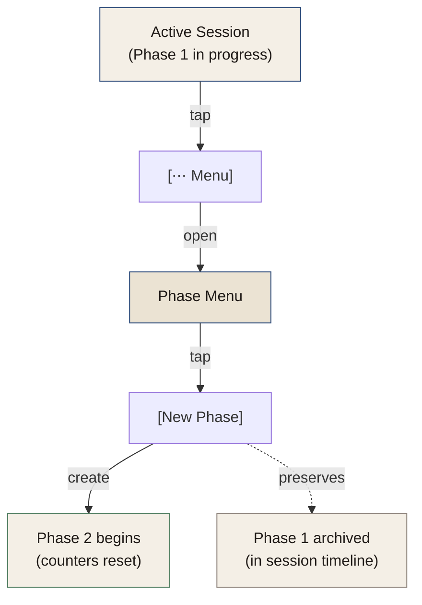

# F-005: Session & Phase Tracking

Structure play into **sessions** (one visit to the app) and **phases** (narrative units of exploration or combat). Track counters per phase and show a recap when the session ends.

## What it does

- **Start a new session** — within an existing campaign, begin a play instance
- **Create and move through phases** — each phase is one narrative beat; players decide when to move on
- **Track counters** — exploration and combat counters per phase, player-controlled
- **End session** — close the play instance and see a recap (flips made, phases completed, entries written)
- **Resume a paused session** — pick up mid-session from where you left off

## How phases work

A **phase** combines exploration and optional combat. Counters are narrative momentum trackers — they do not mechanically win or lose anything; the player decides when they matter. The app counts, the player interprets.

- **Exploration counter:** typically 0–6 (Colostle default). Player increments as they explore.
- **Combat counter:** typically 0–6 if combat is triggered within the phase. Player increments as combat progresses.
- Players can have both counters active in the same phase if narrative calls for it.
- Counter limits are configurable (the defaults are Colostle-standard but can be overridden per campaign — see open question below).

## Contracts

**Start Session:**
- Precondition: an existing campaign exists
- Input: campaign ID
- Output: new Session record created with `startedAt` timestamp, status `active`
- Side effect: Play tab shows active session, new Phase created automatically to start play

**Start New Phase:**
- Precondition: an active session exists
- Input: session ID
- Output: new Phase record created, counters at zero
- Note: previous phase is not ended explicitly — phases coexist in a session timeline

**Increment Counter:**
- Input: phase ID, counter type (`exploration` | `combat`), direction (`up` | `down`)
- Output: counter value updated
- Note: counters cannot go below zero; no hard ceiling enforced by the app (player decides limits)

**End Session:**
- Input: session ID
- Output: session `endedAt` set, status set to `complete`
- Side effect: recap screen shown before returning to Home tab

**Resume Session:**
- Precondition: a session exists with status `active` (no `endedAt`)
- Input: campaign ID
- Output: Play tab loads with the most recent phase state restored (counters, flip position)

## UX Flows

### Flow 1: "Start a New Session and Play a Phase"

**User goal:** I want to start playing. I'll open a campaign and begin.

```mermaid
graph TD
    A["Home Tab<br/>(campaign list)"]
    B["Campaign Detail"]
    C["Play Tab<br/>(empty state)"]
    D["Campaign Picker<br/>(modal)"]
    E["Active Session<br/>(phase in progress)"]
    F["Phase Header<br/>(counters + flip controls)"]

    A -->|[Tap campaign]| B
    B -->|[Resume Latest]<br/>or [New Session]| E
    C -->|[Start Session]| D
    D -->|[Select campaign]| E
    E -->|playing| F

    style A fill:#f4efe6,stroke:#2b4a7a,color:#1f1a17
    style B fill:#f4efe6,stroke:#2b4a7a,color:#1f1a17
    style D fill:#ebe3d3,stroke:#2b4a7a,color:#1f1a17
    style E fill:#f4efe6,stroke:#2b4a7a,color:#1f1a17
    style F fill:#f4efe6,stroke:#4a7a5c,color:#1f1a17
```

**User actions:**
1. Tap campaign on Home → Campaign Detail
2. Tap [New Session] or [↻ Resume Latest]
3. Play tab activates; first phase begins automatically
4. Phase header shows: session name (e.g., "Session 3"), phase number (e.g., "Phase 1"), counters at zero
5. Player flips and plays

### Flow 2: "Track Counters During a Phase"

**User goal:** I just explored a new area. I want to tick up my exploration counter.

```mermaid
graph TD
    A["Active Session<br/>(Play Tab)"]
    B["Phase Section<br/>(counters visible)"]
    C["Exploration Counter<br/>[−] [3] [+]"]
    D["Combat Counter<br/>[−] [0] [+]"]
    E["Counter updated<br/>(value changes inline)"]

    A -->|always visible| B
    B -->|tap [+]| C
    B -->|tap [+]| D
    C -->|instant update| E
    D -->|instant update| E

    style A fill:#f4efe6,stroke:#2b4a7a,color:#1f1a17
    style B fill:#f4efe6,stroke:#2b4a7a,color:#1f1a17
    style E fill:#f4efe6,stroke:#4a7a5c,color:#1f1a17
```

**User actions:**
1. Counter row is always visible in the Play tab, below the oracle prompt area
2. Tap [+] to increment; tap [−] to decrement
3. Value updates immediately (no save required)
4. Both exploration and combat counters are shown; player only uses what applies
5. Counters persist across flips within the same phase

**Combat trigger:**
- If the player decides this phase involves combat, they tap [Combat] to activate the combat counter
- Combat counter starts at zero and tracks separately from exploration

### Flow 3: "Start a New Phase"

**User goal:** I've finished exploring this area. I want to move to the next phase.



**User actions:**
1. Tap [⋯ Menu] in Play tab
2. Phase menu opens: [New Phase], [End Session], [View Session Recap], [Cancel]
3. Tap [New Phase]
4. Phase 2 begins; counters reset to zero
5. Phase 1 is preserved in the session timeline (visible via session recap)

### Flow 4: "End Session and View Recap"

**User goal:** I'm done playing for tonight. I want to see what I did and then close out.

```mermaid
graph TD
    A["Active Session<br/>(Play Tab)"]
    B["[⋯ Menu]"]
    C["[End Session]"]
    D["Session Recap<br/>(modal or screen)"]
    E["[Close]"]
    F["Home Tab<br/>(campaign list)"]

    A -->|tap| B
    B -->|tap| C
    C -->|generate| D
    D -->|[Close]| E
    E -->|navigate| F

    style A fill:#f4efe6,stroke:#2b4a7a,color:#1f1a17
    style D fill:#f4efe6,stroke:#2b4a7a,color:#1f1a17
    style F fill:#f4efe6,stroke:#4a7a5c,color:#1f1a17
```

**User actions:**
1. Tap [⋯ Menu] → [End Session]
2. Session Recap shown:
   - Session number and duration
   - Phases played (count)
   - Flips made (count, by oracle type)
   - Journal entries written (count)
   - Deck status (cards remaining)
3. Tap [Close] → returns to Home tab
4. Campaign list shows updated "last played" date

## Screen Details

**Play Tab: Active Session Header**
```
Session 3 — The Iron Vale
────────────────────────────────
Phase 2
  Exploration  [−] [4] [+]
  Combat       [−] [0] [+]   [Activate Combat]

Deck: 34 cards remaining
```

**Phase Menu (⋯)**
```
├─ [New Phase]
├─ [End Session]
├─ [View Session Recap]
└─ [Cancel]
```

**Session Recap**
```
Session 3 complete
────────────────────────────────
Duration: ~45 minutes
Phases: 3
Flips: 8  (5 exploration, 2 combat, 1 yes-no)
Journal entries: 6
Deck remaining: 34 / 52

[Close]
```

## Open Question

**Counter limits:** Should the app enforce a maximum (e.g., exploration caps at 6)? Colostle's rules use 6 as the default ceiling, but house rules vary. Options:
1. No ceiling enforced — player manages it (simplest)
2. Configurable ceiling per campaign at creation time
3. Fixed ceiling with a visual indicator (progress bar fills at 6)

Recommend option 1 for v0.1.0; revisit in v0.2.0 if playtesting reveals confusion.

## Design References

**Design system:** Counters use large Caveat numerals with [−] and [+] tap targets (min 44×44px). Counter row in `.wf-box` container. Session header in Kalam, medium weight. Recap uses `.wf-box-dashed` (draft/summary aesthetic, not a primary screen).

**Accessibility:** [+] and [−] buttons need `aria-label` attributes ("Increase exploration counter", etc.).

## Related

- **Epic:** [E-001: Portable Solo Play](../epics/E-001-portable-solo-play.md)
- **Feature:** [F-002: Card Flip & Oracle Lookup](./F-002-card-flip-oracle-lookup.md)
- **Feature:** [F-003: Narrative Journaling](./F-003-narrative-journaling.md)
- **Domain terms:** Session, Phase, Counter, Flip (see [CONTEXT.md](../../CONTEXT.md))
- **Design:** See [DESIGN.md](../DESIGN.md) for typography, spacing, components
- **IA:** See [INFORMATION-ARCHITECTURE.md](../INFORMATION-ARCHITECTURE.md) for Play tab structure
- **Data:** See [DATA-MODEL.md](../DATA-MODEL.md) for Session and Phase object schemas
